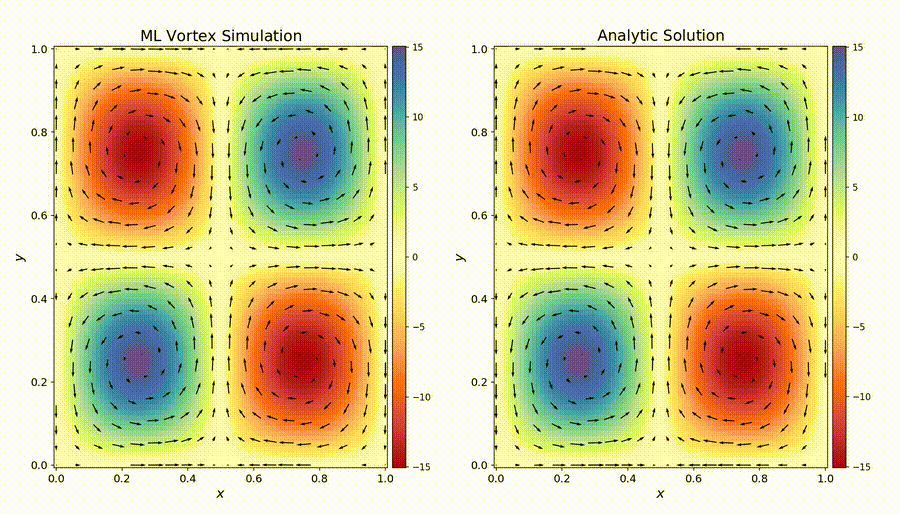

# Physics-Informed Neural Network for 2D Fluid Vortices

Physics-informed neural network for the 2D Taylor-Green vortex, comparing a trained neural network to an analytic solution to the Navier-Stokes equations. Unlike supervised learning, a PINN can be trained without empirical data. It instead learns by minimizing the governing PDEs over the solution domain.

## Overview

We implement a physics-informed neural network (PINN) for the two-dimensional Taylor–Green vortex. We train the network to model the time-dependent velocity field $\mathbf{u}=(u,v)$ and vorticity $\omega=\partial_xv-\partial_yu$ of an incompressible fluid. The loss is given by the integral of the squared PDE residuals,

```math
\large
\mathcal{L}_{\mathrm{EOM}}
=
\mathop{\Large\int}\limits_{\Omega\times[0,T]}
\left[
\left(
\partial_t\omega
+\vec{u}\cdot\nabla\omega
-\nu\nabla^2\omega
\right)^2
+
\left(
\omega-\nabla\times\vec{u}
\right)^2
+
\left(
\nabla\cdot\vec{u}
\right)^2
\right]
\,d^2x\,dt .
```
<br>

where $\nu$ is the kinematic viscosity, $\Omega$ is the spatial domain, and $[0,T]$ is the time interval over which the system is evolved.

## Results

The resulting flow is shown below. This animation compares the velocity and vorticity fields predicted by the PINN against the analytic Taylor–Green solution.

<p align="center">
  <a href="vortex_comparison.mp4">
    
  </a>
</p>

<p align="center">
  <em>The arrows represent the fluid velocity <strong>u</strong>, while the colours represent the vorticity ω, with red indicating positive vorticity and blue indicating negative vorticity. Click the animation to view the full MP4.</em>
</p>

## Method

The model is a fully connected neural network with four hidden layers of width 64 and sinusoidal activation functions. It maps each spacetime coordinate to the vorticity and velocity fields,

```math
\large
(x,y,t)
\longmapsto
\bigl(\omega(x,y,t),\vec{u}(x,y,t)\bigr),
\qquad
\vec{u}=(u,v).
```

<br>

The network is trained by enforcing the following physical constraints.

### Vorticity evolution

The vorticity obeys the advection–diffusion equation,

```math
\large
\partial_t\omega
+
\vec{u}\cdot\nabla\omega
-
\nu\nabla^2\omega
=
0.
```

<br>

This requires the learned vorticity to evolve consistently with the learned velocity field.

### Vorticity–velocity consistency

The vorticity is related to the velocity by

```math
\large
\omega
=
\nabla\times\vec{u}
=
\partial_xv-\partial_yu.
```

<br>

This couples the independently predicted vorticity and velocity fields.

### Incompressibility

The velocity field is constrained to be divergence-free,

```math
\large
\nabla\cdot\vec{u}
=
\partial_xu+\partial_yv
=
0.
```

<br>

### Periodic boundary conditions

The Taylor–Green vortex is defined on the periodic spatial domain
$\Omega=[0,1]\times[0,1]$. For each predicted field
$f\in\{\omega,u,v\}$, the loss enforces

```math
\large
f(0,y,t)=f(1,y,t),
\qquad
f(x,0,t)=f(x,1,t).
```

<br>

### Initial conditions

At $t=0$, the loss constrains the predicted fields to match the analytic Taylor–Green initial conditions,

```math
\large
\bigl(\omega,\vec{u}\bigr)(x,y,0)
=
\bigl(\omega_0,\vec{u}_0\bigr)(x,y).
```

<br>

### Mean-velocity constraint

The velocity is required to have zero spatial mean,

```math
\large
\int_{\Omega}\vec{u}(x,y,t)\,d^2x
=
\vec{0}.
```

<br>

This fixes the spatially uniform velocity component that is not determined by the vorticity and incompressibility constraints alone.

## Analytic solution

The analytic Taylor–Green solution used for comparison is

```math
\large
\begin{aligned}
u(x,y,t)
&=
U_0\sin(kx)\cos(ky)e^{-2\nu k^2t},
\\[0.8em]
v(x,y,t)
&=
-U_0\cos(kx)\sin(ky)e^{-2\nu k^2t},
\\[0.8em]
\omega(x,y,t)
&=
2U_0k\sin(kx)\sin(ky)e^{-2\nu k^2t}.
\end{aligned}
```

<br>

Here, $U_0$ is the initial velocity amplitude, $\nu$ is the kinematic viscosity, and the wavenumber is

```math
\large
k=2\pi n,
```

<br>

where $4n^2$ gives the total number of vortices contained within the domain $\Omega$.


## Requirements

Install the Python dependencies:

```bash
pip install torch numpy matplotlib
```

Install `ffmpeg` for MP4 output:

```bash
brew install ffmpeg       # macOS
sudo apt install ffmpeg   # Ubuntu
```

## Running

```bash
python main.py
```

The script prints the training losses and saves the comparison as `vortex_comparison.mp4`.
